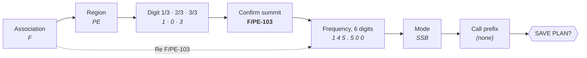

<div align="center">

# 🏔️ F4LEK – T-Echo APRS (SOTA)

**APRS-over-LoRa firmware (433 MHz) for the LilyGO T-Echo / T-Echo Plus, built for SOTA activations.**

Plan your activation at home, then self-spot your summit through **APRS2SOTA** in a
couple of clicks and see on the e-paper screen that the spot went through.


[What it adds](#-what-this-fork-adds) •
[Buttons](#-buttons) •
[SOTA guide](#-sota-step-by-step) •
[Flashing](#-flashing) •
[Building](#-building)

</div>

---

## 🙏 Based on EA2OY APRS System

This is a fork of **[EA2OY APRS System](https://github.com/EA2OY/EA2OY-APRS-SYSTEM)**
("Kacho System") by EA2OY. It brings the whole base: LoRa APRS digipeater and tracker,
smart beaconing profiles, telemetry, APRS messaging, flash trip log, the e-paper driver
and the web configurator. All credit for that goes to EA2OY.

> 📘 For every function that is not SOTA-related, see his
> [user manual](assets/Manual_Kacho_System.pdf).

## ✨ What this fork adds

| | Feature | What you get |
|:-:|---|---|
| 🗺️ | **SOTA menu** | Plan the activation once (summit, frequency, mode, callsign), then spot it in a couple of clicks with a comment (QRV, QSY, QRT, TEST). |
| 📟 | **SOTA screen** | The plan, the APRS2SOTA status of the last spot and the UTC time for your log. |
| 🔁 | **Leaner carousel** | Home → SOTA → Messages → Stations → Last RX → Last TX. |
| 🏠 | **Clean home screen** | Position, speed, altitude, satellites, received messages. |
| ✉️ | **Messages screen** | Keeps the received APRS messages. |
| 🇬🇧 | **English UI** | All menus and screens. |

---

## 🔘 Buttons

The T-Echo has two controls: the **touch key** (capacitive pad) and the **physical button**.

| Gesture | On the screens (carousel) | In the menu and the SOTA wizard |
|---|---|---|
| 👆 **Touch key** | next screen | move down the list (wraps around to the top) |
| 🔘 **Short press** | next screen | **enter / confirm** |
| 🔘 **Long press** | **open the menu** | **go back one step** (from the first step: leave) |
| 🔘 **Double press** | send a position beacon | edit a number: decrease it · SOTA wizard: ignored |

> 💡 **Rule of thumb:** touch to *move*, short to *go forward*, long to *go back*.
> Menu and wizard close by themselves after **60 s** without a touch. Nothing gets saved or sent
> if they time out.

---

## 🗻 SOTA step by step

SOTA works in **two stages**, both in the `SOTA` section of the menu:

| | When | Menu entry | What you do |
|:-:|---|---|---|
| **1** | at home, the day before | `Plan activation` | pick summit, frequency, mode, callsign prefix → saved in flash |
| **2** | on the summit | `SOTA spot` | pick a comment → the spot goes out to APRS2SOTA |

The heavy part (scrolling through lists, entering digits) happens once, at home.
On the summit it takes **three presses**.

### 0 · Before your first activation

Set your **callsign** (web configurator or on-device menu). The SOTA callsign is built from it:
the SSID is removed and `/P` is added, e.g. `F4LEK-7` → `F4LEK/P`.
If your callsign already has a `/`, it is used as it is.

### 1 · Reach the SOTA menu

```
 On any screen                Main menu                    SOTA section
 ─────────────                ─────────                    ────────────
                              ▸ Exit                       ▸ < Back
   LONG press  ────────▶        Sleep          touch ×2      Exit
                                SOTA          ─────────▶     Plan activation   ◀ touch ×2
                                Messages      then SHORT     SOTA spot         ◀ touch ×3
                                …
```

1. **Long press** → the main menu opens with the cursor on `Exit`.
2. **Touch twice** → cursor on `SOTA`. **Short press** to enter.
3. **Touch twice** → `Plan activation`, or **three times** → `SOTA spot`. **Short press** to start.

### 2 · Plan the activation

Each step shows its title at the top of the screen. **Touch** moves the cursor, **short press**
validates and goes to the next step, **long press** goes back to the previous step with your
previous choice still selected, so you can fix one value without starting over.



| # | Screen title | What to pick | Example |
|:-:|---|---|---|
| 1 | `Association` | the SOTA association. See [the association list](#the-association-list) below. | `F` |
| 2 | `Region` | the region code inside that association | `PE` |
| 3 | `Digit 1/3`, `2/3`, `3/3` | the summit number, one digit per screen (`0`–`9`) | `1`, `0`, `3` |
| 4 | `Confirm summit` | the reference is shown large. **Short** = OK, **long** = fix the last digit | `F/PE-103` |
| 5 | `Freq. hundreds` … `Freq. thousandths` | the frequency in MHz, 6 digits in the form `000.000`, one digit per screen | `1` `4` `5` . `5` `0` `0` |
| 6 | `Mode` | `AM` · `CW` · `DATA` · `DV` · `FM` · `SSB` · `OTHER` (the modes APRS2SOTA accepts) | `SSB` |
| 7 | `Call prefix` | `(none)` when you activate in your own country, otherwise the country prefix | `(none)` or `EA2` |
| 8 | `SAVE PLAN?` | shows the full spot text. **Short** = save, **long** = go back and edit | |

After saving you are back in the SOTA menu, and the plan appears on the **SOTA screen** of the
carousel. It stays in flash across reboots until you plan another activation.

> [!TIP]
> **Entering a frequency:** every digit starts at `0`, and the touch key only counts **up**
> (after `9` it wraps to `0`). For `145.500`: touch ×1 → short, touch ×4 → short, touch ×5 → short,
> touch ×5 → short, short, short.

#### The association list

The association list is long, so the firmware puts shortcuts **at the top**:

```
 ┌─────── Association ───────┐
 │ ▸ Re F/PE-103             │  ◀ same summit and prefix as last time
 │   * F                     │  ◀ your recent associations (up to 4), marked *
 │   * EA2                   │
 │   3Y                      │  ◀ then the full list, in order
 │   4O                      │
 │   …                       │
 └───────────────────────────┘
```

- **`Re F/PE-103`** reuses your last summit **and** your last call prefix, and jumps straight to
  the **frequency**. You only choose frequency and mode again. Handy for a second band or a QSY.
- **`* F`, `* EA2`…** are the associations you used recently. Picking one continues normally
  with the region.

### 3 · Spot from the summit

1. **Long press** → **touch ×2** → **short** (`SOTA`) → **touch ×3** → **short** (`SOTA spot`).
2. `Comment`: pick one and **short press**.

   | Comment | Meaning |
   |---|---|
   | `(none)` | no comment |
   | `QRV` | I'm on the air, call me |
   | `QSY` | I'm changing frequency / mode |
   | `QRT` | I'm going off the air |
   | `TEST` | test spot |

3. `SEND SPOT?` shows the exact message. **Short press** sends it, **long press** goes back.

The spot is sent as an APRS message to **`APRS2SOTA`**:

```
F/PE-103 145.500MHz SSB F4LEK/P QRV
```

With a call prefix, the callsign becomes `EA2/F4LEK/P`.
The wizard closes and the bottom line shows `SOTA: sent` (or `SOTA: TX failed`).

> [!NOTE]
> If you open `SOTA spot` without a plan, the device shows `SOTA: no plan`. Plan first.
> To QSY to another band, use `Plan activation` → **`Re …`** (frequency + mode only), then
> `SOTA spot` → `QSY`.

### 4 · Check the SOTA screen

Short press or touch through the carousel until the **SOTA** screen:

```
 ┌──────────── SOTA ────────────┐
 │         F4LEK/P              │   callsign used for the spot
 │       on F/PE-103            │   summit
 │      145.500 SSB             │   frequency + mode
 │ ──────────────────────────── │
 │        APRS status:          │
 │          Spotted             │   ◀ answer from APRS2SOTA
 │ ──────────────────────────── │
 │         10:42 UTC            │   for your log
 └──────────────────────────────┘
```

| Status | Meaning | What to do |
|---|---|---|
| `--` | no spot sent since power-on | |
| ⏳ `Sending` | sent, waiting for the gateway's answer | wait. The APRS message is retried automatically. |
| ✅ **`Spotted`** | the spot is published on SOTAwatch | you're on the air, work the pile-up |
| ♻️ `Dupe` | that spot already exists | nothing to do |
| ❌ `Error` | the gateway refused it (e.g. unknown mode or summit) | check the plan and send again |
| 📵 `Not sent` | radio error, or no acknowledgement after all retries | no iGate in range: move, or try again later |

The full answer from APRS2SOTA is also on the **Messages** screen. The status is kept in RAM only
and resets to `--` after a reboot.

---

## ⚙️ Configuration

Open the web configurator (`web/index.html`) in **Chrome or Edge**, connect over USB and set at
least your **callsign**. The most common settings are also in the on-device menu.

---

## 🔌 Flashing

### Bootloader upgrade (S140 7.3.0), once per device

The T-Echo ships with bootloader 0.6.1 + S140 **6.1.1**. This firmware targets
**bootloader 0.11.0 + S140 7.3.0** (applications start at `0x27000`). Every file you
need is in [`bootloader/`](bootloader/). Source and full guide:
[ViezeVingertjes/lilygo-techo-bootloader](https://github.com/ViezeVingertjes/lilygo-techo-bootloader).

1. **Check.** Double-press reset → the `TECHOBOOT` drive appears. `INFO_UF2.TXT` should
   show `s140 6.1.1` and `Board-ID: nRF52840-TEcho-v1`.
2. **Flash bootloader + SoftDevice over serial DFU.** Only the `.zip` can change the
   SoftDevice; the `.uf2` files cannot.
   ```bash
   pip install --user adafruit-nrfutil
   adafruit-nrfutil --verbose dfu serial \
     --package bootloader/lilygo_techo_bootloader-0.11.0_s140_7.3.0.zip \
     -p /dev/ttyACM0 -b 115200 --singlebank --touch 1200
   ```
   On Windows, use `-p COMx`. After this the T-Echo has no application and stays in the
   bootloader. That is expected.
3. **Optional test.** Copy `bootloader/techo_sd730_sample.uf2` onto `TECHOBOOT`. A blue
   LED blinking at 1 Hz means S140 7.3.0 is running. `INFO_UF2.TXT` now shows
   `s140 7.3.0` and `Bootloader: 0.11.0`.

> [!WARNING]
> After the upgrade, only flash firmware built for S140 7.x (`0x27000`). An old 6.1.1 build
> (`0x26000`) overwrites the end of the SoftDevice. If that happens, redo step 2.
> To go back to factory, flash LilyGO's `0.6.1_s140_6.1.1` package the same way.

### The firmware

Double-press reset and copy
[`firmware/release/F4LEK-TECHO-APRS_v1.0alpha_b104_T-Echo_S140v7.uf2`](firmware/release/F4LEK-TECHO-APRS_v1.0alpha_b104_T-Echo_S140v7.uf2)
onto `TECHOBOOT` (or your own build, see below).

---

## 🔧 Building

```bash
cd firmware
pio run -e techo_s140v7          # T-Echo
pio run -e techo_plus_s140v7     # T-Echo Plus
```

The UF2 lands in `firmware/.pio/build/<env>/firmware.uf2`.

---

## 📄 Licence

GPL-3.0 (see [`LICENSE`](LICENSE)), inherited from EA2OY APRS System. The files in `bootloader/`
keep their own licences (MIT, and Nordic's licence for the SoftDevice).

<div align="center"><sub>73 de F4LEK · see you on the summits 🏔️</sub></div>
